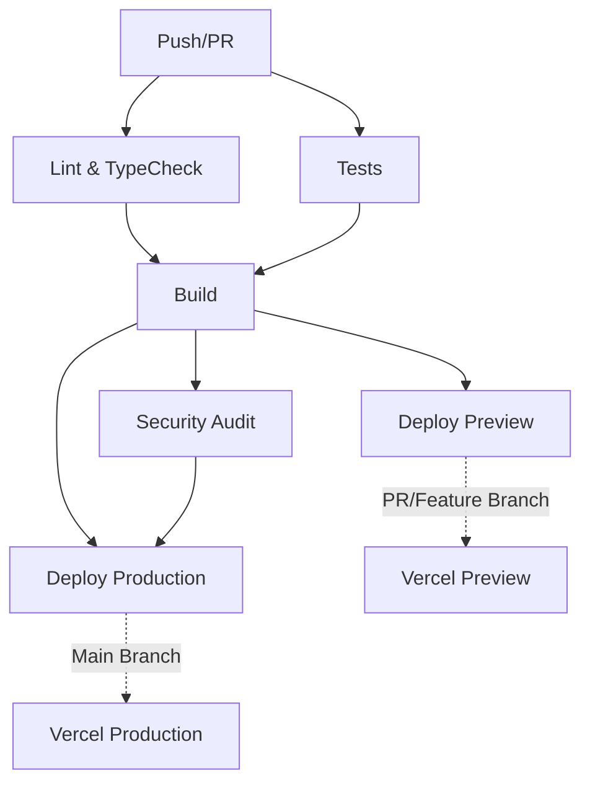

# AgentForge Frontend - Production Deployment Guide

## Overview

This guide covers the complete production deployment setup for the AgentForge frontend, configured for automatic CI/CD with Vercel and GitHub Actions.

## Architecture

- **Framework**: React 19 + Vite 8 + TypeScript
- **State Management**: Zustand + TanStack Query (React Query)
- **Routing**: React Router v7 with lazy-loaded routes
- **Styling**: Tailwind CSS
- **API Client**: Axios with interceptors, token refresh, retry logic
- **PWA**: Workbox via vite-plugin-pwa
- **CI/CD**: GitHub Actions → Vercel

---

## Quick Start

### Prerequisites

- Node.js 20+
- npm 10+
- GitHub repository with Vercel integration
- Production API endpoint

### Local Development

```bash
# Install dependencies
npm install

# Start dev server
npm run dev

# Run tests
npm run test

# Lint & typecheck
npm run lint
npx tsc --noEmit

# Build for production
npm run build
```

---

## Vercel Project Setup

### 1. Link Local Project to Existing Vercel Project

The `.vercel/project.json` and `.vercel/repo.json` files are already configured:

```json
// .vercel/project.json
{
  "projectId": "prj_agentforge_ai_page",
  "orgId": "team_final_commit",
  "projectName": "agentforge-ai-page"
}
```

If you need to relink:

```bash
npx vercel link
```

### 2. Configure Environment Variables in Vercel

Go to Vercel Dashboard → Project Settings → Environment Variables and add:

| Variable | Value | Environment |
|----------|-------|-------------|
| `VITE_API_URL` | `https://api.agentforge.example.com/api/v1` | Production, Preview |
| `VITE_APP_NAME` | `AgentForge` | All |
| `VITE_APP_VERSION` | `1.0.0` | All |
| `VITE_NODE_ENV` | `production` | Production |
| `VITE_NODE_ENV` | `staging` | Preview |
| `VITE_ENABLE_PWA` | `true` | All |
| `VITE_ENABLE_ANALYTICS` | `false` | All |

### 3. Configure GitHub Integration

In Vercel Dashboard → Project Settings → Git:
- **Production Branch**: `main`
- **Auto Deploy**: Enabled
- **Preview Deployments**: Enabled for all branches
- **PR Deployments**: Enabled

---

## GitHub Actions CI/CD

### Workflow: `.github/workflows/frontend-check.yml`

The workflow runs on every push/PR to `main` and `develop` branches:



### Required GitHub Secrets

Go to GitHub Repository Settings → Secrets and variables → Actions:

| Secret | Description |
|--------|-------------|
| `VERCEL_TOKEN` | Vercel access token |
| `VERCEL_ORG_ID` | Vercel organization ID |
| `VERCEL_PROJECT_ID` | Vercel project ID |
| `VITE_API_URL` | Production API URL |
| `VITE_APP_NAME` | Application name |
| `VITE_APP_VERSION` | Application version |

### Getting Vercel Credentials

```bash
# Get Vercel token
npx vercel login
npx vercel token create

# Get org/project IDs
npx vercel inspect <deployment-url> --token=<token>
```

---

## Environment Configuration

### Environment Files

| File | Purpose |
|------|---------|
| `.env.example` | Template for all environments |
| `.env.local` | Local development (gitignored) |
| `.env.production` | Production build (optional) |

### Variable Reference

```bash
# API Configuration
VITE_API_URL=https://api.agentforge.example.com/api/v1

# Application
VITE_APP_NAME=AgentForge
VITE_APP_VERSION=1.0.0

# Environment
VITE_NODE_ENV=production

# Features
VITE_ENABLE_PWA=true
VITE_ENABLE_ANALYTICS=false
VITE_ENABLE_DEBUG=false
```

---

## Production Checklist

### Pre-Deployment

- [ ] All tests pass (`npm run test`)
- [ ] No lint errors (`npm run lint`)
- [ ] No TypeScript errors (`npx tsc --noEmit`)
- [ ] No security vulnerabilities (`npm audit --audit-level=high`)
- [ ] Build succeeds (`npm run build`)
- [ ] Environment variables configured in Vercel
- [ ] GitHub Secrets configured
- [ ] Vercel Git integration enabled

### Post-Deployment Verification

- [ ] Production URL returns HTTP 200: `https://agentforge-ai-page.vercel.app`
- [ ] Assets served with correct cache headers
- [ ] Service worker registered (PWA)
- [ ] API calls work (check Network tab)
- [ ] Authentication flow works
- [ ] All pages load without console errors
- [ ] Dark/light mode toggle works
- [ ] Responsive layout on mobile
- [ ] Protected routes redirect to login
- [ ] Logout/login persistence works
- [ ] Form submissions work
- [ ] File uploads work (if applicable)

### Performance Benchmarks

- [ ] LCP < 2.5s
- [ ] FID < 100ms
- [ ] CLS < 0.1
- [ ] Bundle size < 500KB (gzipped)
- [ ] Service worker caches API responses

---

## API Client Architecture

### Centralized API Client (`src/api/client.ts`)

Features:
- **Base URL**: From `VITE_API_URL` environment variable
- **Timeout**: 30 seconds
- **Credentials**: `withCredentials: true` for cookies
- **Auth**: Automatic Bearer token injection
- **Token Refresh**: Automatic on 401 with retry
- **Retry Logic**: 1 retry with exponential backoff for 5xx errors
- **Error Handling**: Centralized error message extraction

### Usage

```typescript
import { apiClient, http, getApiErrorMessage } from '@/api/client';

// Direct client usage
const { data } = await apiClient.get('/agents/');

// Typed HTTP helpers
const agents = await http.get<Agent[]>('/agents/');
const newAgent = await http.post<Agent>('/agents/', payload);
const updated = await http.put<Agent>(`/agents/${id}`, payload);
const deleted = await http.delete(`/agents/${id}`);

// Error handling
try {
  await apiClient.get('/agents/');
} catch (error) {
  const message = getApiErrorMessage(error);
  // Show user-friendly error
}
```

### API Modules

All API modules in `src/api/` use the centralized client:
- `auth.ts` - Authentication
- `agents.ts` - Agent CRUD
- `tasks.ts` - Task management
- `executions.ts` - Execution tracking
- `analytics.ts` - Analytics data
- `activity.ts` - Activity feed
- `settings.ts` - User/system settings
- `tools.ts` - Tool management
- `permissions.ts` - Permissions
- `system.ts` - System health

---

## PWA Configuration

### Manifest (`public/manifest.json`)

- Name: AgentForge
- Display: standalone
- Theme color: #1a1a2e
- Icons: 72x72 to 512x512 (maskable)
- Shortcuts: Dashboard, Agents, Create Agent

### Service Worker (`vite-plugin-pwa`)

- **Strategy**: Auto-update on navigation
- **Precache**: All static assets
- **Runtime Caching**:
  - API: NetworkFirst (100 entries, 24h)
  - Google Fonts: CacheFirst (1 year)
  - Static assets: CacheFirst

### Offline Support

- Offline page served from cache
- API requests queued when offline
- Background sync on reconnect

---

## Security Headers

Configured in `vercel.json`:

| Header | Value |
|--------|-------|
| `X-Content-Type-Options` | `nosniff` |
| `X-Frame-Options` | `DENY` |
| `X-XSS-Protection` | `1; mode=block` |
| `Referrer-Policy` | `strict-origin-when-cross-origin` |
| `Permissions-Policy` | `camera=(), microphone=(), geolocation=()` |
| `Content-Security-Policy` | Restrictive policy allowing self + API domain |

### CSP Details

```
default-src 'self';
script-src 'self' 'unsafe-inline' 'unsafe-eval';
style-src 'self' 'unsafe-inline';
img-src 'self' data: https:;
font-src 'self' data:;
connect-src 'self' https://api.agentforge.example.com wss://api.agentforge.example.com;
frame-ancestors 'none';
base-uri 'self';
form-action 'self';
```

---

## Performance Optimizations

### Code Splitting

- **Route-level**: All pages lazy-loaded with `React.lazy()`
- **Vendor chunks**: Separate chunks for react, query, ui, forms, state
- **Dynamic imports**: Heavy components loaded on demand

### Build Optimizations

```typescript
// vite.config.ts
build: {
  rollupOptions: {
    output: {
      manualChunks: (id) => {
        // Smart chunking based on module path
      }
    }
  },
  chunkSizeWarningLimit: 1000,
}
```

### Asset Optimization

- **Images**: WebP/AVIF via Vite
- **Fonts**: Preconnect to Google Fonts, self-hosted fallback
- **CSS**: Purged unused Tailwind classes
- **JS**: Minified, gzipped, brotli compressed

---

## Monitoring & Debugging

### Error Tracking

Add Sentry DSN to environment variables:

```bash
VITE_SENTRY_DSN=https://xxx@sentry.io/xxx
```

### Analytics

Add Google Analytics ID:

```bash
VITE_GA_MEASUREMENT_ID=G-XXXXXXXXXX
```

### Health Checks

- `/health` endpoint for load balancer
- Service worker status in console
- React Query devtools in development

---

## Rollback Procedure

### Vercel Rollback

1. Go to Vercel Dashboard → Deployments
2. Find previous successful deployment
3. Click "..." → "Promote to Production"

### Git Rollback

```bash
# Revert last commit
git revert HEAD
git push origin main

# Or reset to specific commit
git reset --hard <commit-sha>
git push --force origin main
```

---

## Troubleshooting

### Build Failures

| Issue | Solution |
|-------|----------|
| TypeScript errors | Run `npx tsc --noEmit` locally first |
| Missing env vars | Check Vercel project settings |
| Dependency conflicts | Use `--legacy-peer-deps` |
| Out of memory | Increase Node memory: `NODE_OPTIONS="--max-old-space-size=4096"` |

### Runtime Errors

| Issue | Solution |
|-------|----------|
| API 401 errors | Check token refresh logic |
| CORS errors | Verify API domain in CSP |
| Blank page | Check service worker, clear cache |
| Hydration mismatch | Ensure SSR-compatible code |

### PWA Issues

| Issue | Solution |
|-------|----------|
| SW not registering | Check HTTPS, manifest.json validity |
| Updates not showing | Hard refresh, check `onNeedRefresh` |
| Offline not working | Verify runtime caching rules |

---

## Support

- **Documentation**: This guide + inline code comments
- **Issues**: GitHub Issues in `final-commit-15/FRONTEND`
- **Vercel Logs**: Vercel Dashboard → Functions → Logs
- **GitHub Actions**: Actions tab in repository

---

## Version History

| Version | Date | Changes |
|---------|------|---------|
| 1.0.0 | 2026-09-05 | Initial production setup |